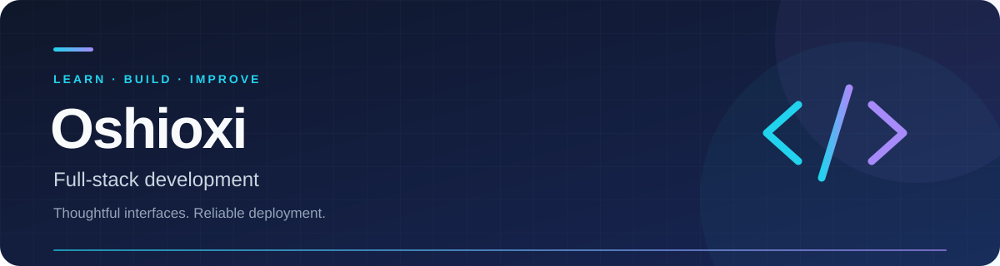

  

<strong>EAUT Graduate · Full-stack Learner · Practical Problem Solver</strong>

Building useful web applications with clean interfaces and reliable foundations.

  
  
  

  <a href="#about-me">About</a> · <a href="#technology">Technology</a> · <a href="#current-focus">Current focus</a> · <a href="#connect">Connect</a>

---

## About me

I'm an **EAUT graduate** developing my full-stack skills through practical web applications. I enjoy turning small ideas into useful tools, with attention to the user experience and the infrastructure behind it.

- **Design:** simple layouts, clear interactions, and interfaces that work well in light and dark themes.
- **Development:** solid backends, responsive frontends, and maintainable components.
- **Deployment:** reproducible environments and reliable CI/CD workflows.
- **Collaboration:** open to working together and exchanging knowledge with the IT community.

## Technology

My main learning stack combines **Django / DRF**, **Vue.js**, **Tailwind CSS**, **MySQL**, and **Docker**.

  

| Area | Technologies I work with or explore |
| :--- | :--- |
| **Backend** | Python · Django · Django REST Framework · FastAPI · Flask |
| **Frontend** | JavaScript · TypeScript · Vue.js · React · HTML · CSS · Tailwind CSS · Bootstrap |
| **Data** | MySQL · PostgreSQL · SQLite · Redis |
| **Infrastructure** | Docker · Nginx · Linux · AWS · GCP · Cloudflare · CI/CD |
| **Tools & platforms** | Node.js · Git · GitHub · GitLab · Postman · Figma · Firebase · Vercel · Netlify |

## Current focus

| Focus | What I'm practicing |
| :--- | :--- |
| **Application development** | Small services with Django / DRF and Vue 3 |
| **Deployment & performance** | Docker Compose, Nginx reverse proxies, and cache optimization |
| **Code quality** | Automated tests with pytest and formatting with Ruff / Black |
| **Interface design** | Reusable Tailwind components and light / dark theme support |

## GitHub activity

Explore my [repositories and contribution history](https://github.com/Oshioxi2003).

  
<strong>Show GitHub statistics</strong>

   
  

    
  

  

    
  

  
Statistics depend on the availability of a third-party service.

## Connect

Have an idea to discuss or a project to collaborate on? Reach me at **[toanwa1@gmail.com](mailto:toanwa1@gmail.com)** or connect on **[LinkedIn](https://linkedin.com/in/oshioxi)**.

  
<strong>More places to find me</strong>

   

  [Discord](https://discord.gg/oshioxi) · [Facebook](https://facebook.com/oshioxi2003) · [Instagram](https://instagram.com/oshioxi2003) · [Reddit](https://reddit.com/user/oshioxi) · [TikTok](https://tiktok.com/@oshioxi) · [X / Twitter](https://twitter.com/oshi_oxi110103)

  

---

Keep learning. Build thoughtfully. Make something useful.

